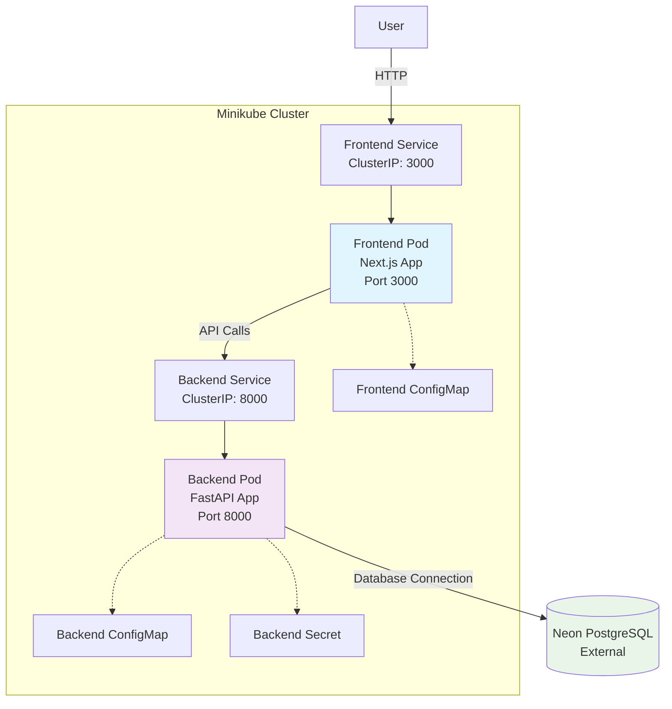

# Kubernetes Deployment Architecture

## Component Descriptions

### Frontend Service
- **Pod**: Runs Next.js application in a container
- **Image**: todo-frontend:latest
- **Port**: 3000
- **Purpose**: Serves the user interface and handles user interactions

### Backend Service
- **Pod**: Runs FastAPI application in a container
- **Image**: todo-backend:latest
- **Port**: 8000
- **Purpose**: Provides REST API endpoints and connects to the database

### External Database
- **Provider**: Neon PostgreSQL (external to cluster)
- **Connection**: Via SSL using database URL from Kubernetes Secret
- **Purpose**: Stores application data (users, tasks, conversations)

### Configuration
- **ConfigMaps**: Store non-sensitive configuration values
- **Secrets**: Store sensitive data like database credentials and JWT secrets